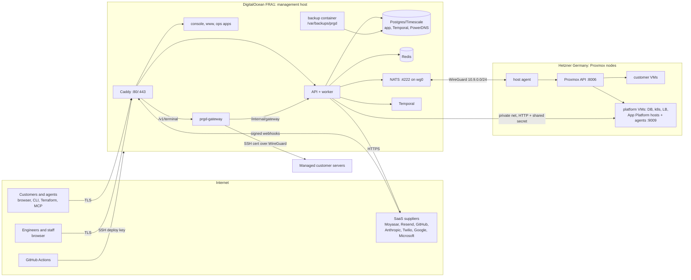

# Threat model

| | |
|---|---|
| Document owner | [Security owner — to be named], with [Engineering lead — to be named] |
| Approved by | [Management — to be named], [Date] |
| Version | Draft, 6 October 2026 |
| Review | On every change listed in risk-methodology.md §6, and at least yearly |
| ISO/IEC 27001:2022 | Annex A 5.8, 8.26, 8.27 |
| NCA | ECC Governance domain (cybersecurity in IT projects); CCC Defense |
| Checklist | Controls 39, 132, 46-54, 133 |

Method: STRIDE (Spoofing, Tampering, Repudiation, Information disclosure, Denial of service,
Elevation of privilege) per trust boundary. "Status" names the controls in place, those added on
`feat/security-iso` (marked *branch*), and open gaps with their risk register id.

## 1. System context

## 2. Data flows of sensitive information

| Flow | Data | Path | Protection |
|---|---|---|---|
| F1 Sign up / sign in | Email, password, TOTP, OAuth identity, IP, user agent | Browser → Caddy (TLS) → API → Postgres; Google/Microsoft OAuth | TLS, argon2id, sealed TOTP seed, rate limits, lockout (*branch*), audit |
| F2 Console and API use | Session token / API token, resource data | Browser or client → Caddy → API → Postgres, Temporal, NATS | Bearer tokens, scopes, audit of changes |
| F3 Provisioning | VM spec, cloud-init with SSH keys and user-data | API → Temporal → NATS (WireGuard) → host agent → Proxmox | NATS token, WireGuard, job ids |
| F4 Platform agents | DB passwords, S3 keys, k8s join tokens | API/worker → platform VM agent :9009 on the private network | Shared header secret, CONTROL_PLANE_CIDR; **no TLS (R-11)** |
| F5 Payments | Payer data, card data | Browser → Moyasar hosted page; webhook → API | Card data never on Progrid; webhook signatures |
| F6 Mail | Email address, message content, invoices | API → Resend (or Postmark); inbound mail → Resend → API webhook | TLS, webhook signature |
| F7 Connect | Prompts, tool inputs and outputs, connection credentials | API → Anthropic; API → customer-configured endpoints | Secrets sealed, never sent to the model, SSRF guard, approvals |
| F8 Git Deploy | Repository contents, installation tokens | GitHub → API webhook; App Platform host clones the repository | Webhook secret, short-lived installation tokens, token redaction (*branch*) |
| F9 Engineer sessions | Terminal I/O, injected sudo passwords, recordings | Ops browser → gateway (WSS) → managed server (SSH over WireGuard); recording → bucket | One-time token, grant, certificate, recording, masking |
| F10 Backups | Full database dump incl. sealed secrets and personal data | Postgres → backup container → `/var/backups/prgd` → (off-site, when configured) | age encryption before leaving the host (*branch*); **same host today (R-02)** |
| F11 Deploy | Images, deploy key | GitHub Actions → ghcr.io → management host over SSH | Provenance, Trivy, forced-command user, pinned host key (*branch*) |
| F12 Paging | Phone numbers, alert text | API → Twilio | TLS, only when `PAGING_MODE=live` |

## 3. Trust boundaries and threats

### TB1. Internet → Caddy → API

| STRIDE | Threat | Status |
|---|---|---|
| S | Credential stuffing, stolen tokens, forged webhooks | Rate limits (`rate-limit.guard.ts`), fail-closed on auth and lockout (*branch*); webhook signatures (Moyasar, Resend Svix, GitHub; Stripe when enabled); MFA for owners and staff |
| T | Request smuggling, header spoofing of `X-Forwarded-For` | Caddy overwrites `X-Real-IP` and `X-Forwarded-For`; apps reachable only through Caddy (edge/backend networks, *branch*) |
| R | Customer denies an action | Audit interceptor for every state-changing call, hash chain (*branch*) |
| I | Internal errors, Swagger, `/internal/*` exposure | Error filter; Swagger off in production; `/internal/*` blocked at Caddy (*branch*); security headers and HSTS |
| D | DDoS, expensive endpoints | Rate limits; body size limit (*branch*); provider DDoS only, **no CDN/WAF (R-24)** |
| E | Broken object-level authorization, admin routes reachable by customers | Scope and team checks; fixes R1-R8 and tenant isolation tests (*branch*); back office needs staff + TOTP, optional IP allowlist (*branch*) |

### TB2. Console and ops console in the browser

| STRIDE | Threat | Status |
|---|---|---|
| S | Session token theft through XSS (token in browser storage) | CSP for console and www (*branch*), React escaping, idle timeouts; residual risk R-18 |
| T | Malicious script modifies requests | CSP; no third-party scripts |
| R | — | Audit log |
| I | Token leakage in URLs or referrers | Tokens in headers; gateway token sent as first WebSocket frame, not in the URL |
| D | — | — |
| E | CSRF | Bearer tokens (no ambient cookies) on `/v1` and `/admin`; ops cookie accepted on GET only |

### TB3. API → NATS → host agents; API → platform agents

| STRIDE | Threat | Status |
|---|---|---|
| S | Rogue client publishes jobs to NATS; fake agent | NATS token; NATS bound to the WireGuard address; per-node credentials planned (checklist 78) |
| T | Job tampering in transit | WireGuard for NATS; platform agent channel plain HTTP on the private network (R-11) |
| R | Unattributed hypervisor change | Jobs carry ids derived from workflows; audit of the API call |
| I | Platform agent secrets sniffed on the tenant network | Agents on private addresses, `CONTROL_PLANE_CIDR`; **TLS missing (R-11)** |
| D | Flooding the agent or NATS | Rate limits at the API; JetStream limits [to configure] |
| E | Customer VM reaches the management network or Proxmox API | Proxmox 8006 only from `10.9.0.0/24`; tenant pool separated; DOCKER-USER drops on app hosts (*branch*); see R-10 |

### TB4. App Platform shared hosts (customer and AI-generated code)

| STRIDE | Threat | Status |
|---|---|---|
| S | App impersonates another app's hostname | Per-host routing; custom domain verification **missing** (readiness review item 22) |
| T | Build injection modifies the host | Shell quoting of build input (fixed); build CPU/memory limits and 15 min timeout (*branch*) |
| R | Customer denies deploying abusive content | Audit of deploys, build logs |
| I | One tenant reads another's env vars or traffic; metadata access | Per-app Docker networks, private ranges and 169.254/16 blocked (*branch*); env vars sealed at rest (*branch*) |
| D | Noisy neighbour, fork bombs, disk fill | pids, memory, ulimit and log limits (*branch*) |
| E | Container escape to the host | cap-drop ALL, no-new-privileges, userns-remap on new hosts, optional gVisor (*branch*); **shared kernel remains (R-09)** |

### TB5. Git Deploy

| STRIDE | Threat | Status |
|---|---|---|
| S | Forged GitHub webhook triggers deploys | `GITHUB_APP_WEBHOOK_SECRET` verification; deploy hook rate limit |
| T | Attacker-controlled repository content runs on the platform | Treated as untrusted code: TB4 controls; base images of other tenants refused (*branch*) |
| R | — | Audit of deploys |
| I | Installation tokens or personal tokens leak in logs | Token redaction in build logs and sealing at rest (*branch*) |
| D | Huge repositories | Build timeout and limits (*branch*) |
| E | GitHub App key leak gives access to all installations | Key only in `prgd.env` (R-13, R-36); rotate on suspicion |

### TB6. Connect AI agents and tool calls

| STRIDE | Threat | Status |
|---|---|---|
| S | Webhook callers impersonate a trigger | Hashed URL tokens, optional signing secret |
| T | Prompt injection makes the agent call tools with harmful input | Approvals for `requiresApproval` tools and every mutating Progrid action; scoped tokens; spend caps |
| R | Who approved an action | Approvals queue and run steps recorded |
| I | Secrets or data exfiltrated to the model or to attacker URLs | Secret variables never rendered to the model; redactor on every result; SSRF guard blocks private, metadata and WireGuard ranges |
| D | Runaway runs and costs | Per-agent and per-team rate limits, concurrent run cap, output token cap |
| E | Agent uses its token beyond its project | Token scopes enforced in the API; agent tokens cannot create tokens or decide approvals |

### TB7. Ops gateway and SSH to managed servers

| STRIDE | Threat | Status |
|---|---|---|
| S | Stolen engineer credentials; spoofed asset host key | TOTP/WebAuthn, IP allowlist, new-device alert; known_hosts required in production (TOFU otherwise, R-37) |
| T | Engineer alters a server beyond the ticket | Grant per asset and ticket, expiry, recordings |
| R | Engineer denies an action | asciicast recording, `ops.*` audit events with host key |
| I | Engineer sees customer contact data or other contracts; sudo password capture | Masking, AssignmentGuard returning 404; password redaction; residual R-15 |
| D | Gateway overload | `PRGD_GATEWAY_MAX_SESSIONS` |
| E | Gateway compromise yields certificates for all assets | Certificates only for the session's asset principal, pinned to `PRGD_GATEWAY_SOURCE_ADDRESSES`; gateway gets only its own settings |

### TB8. Backups

| STRIDE | Threat | Status |
|---|---|---|
| S | — | — |
| T | Attacker modifies or deletes backups | **Same host, no immutability (R-02, R-03)**; object lock planned |
| R | — | Backup status file |
| I | Backup copies leak personal data and sealed secrets | age encryption before leaving the host (*branch*); keys not in the backup |
| D | Backups fail silently | Status file read by the health check; monthly restore test (business-continuity-and-dr.md §6) |
| E | — | — |

### TB9. CI/CD

| STRIDE | Threat | Status |
|---|---|---|
| S | Fork pull request runs with secrets | Fork-PR guard, secrets only in the deploy job on `main` (*branch*) |
| T | Compromised third-party action or dependency alters images | Dependency review, Dependabot, provenance attestations, Trivy (*branch*); pin actions by SHA (planned) |
| R | Who deployed what | Workflow runs, image digests, attestation, deploy log on the host |
| I | Deploy key exfiltrated by a step | No third-party action in the step holding the key; forced-command `deploy` user limits what the key can do (*branch*) |
| D | — | — |
| E | Deploy key gives root on the host | Forced command `/opt/prgd/deploy.sh <tag>` with tag validation; branch protection and environment reviewers (owner to enable) |

## 4. Highest residual threats

1. Container escape or cross-tenant access on shared App Platform hosts (R-09).
2. Single management host holding production, backups and secrets (R-01, R-02, R-03, R-13).
3. Shared layer 2 in `shared_bridge` mode (R-08).
4. No WAF/DDoS layer and no central detection (R-24, R-27).
5. Plaintext platform agent channel (R-11).

## 5. Roles, evidence and review

The Security owner keeps this model; the Engineering lead updates it in the pull request that
changes a boundary. Evidence: this file's git history and the linked pull requests. Review at
least yearly and on every trigger in risk-methodology.md §6.

## 6. Mapping

| Framework | Reference |
|---|---|
| ISO/IEC 27001:2022 | Annex A 5.8, 8.26, 8.27, 5.14 |
| NCA ECC | Governance: cybersecurity in IT projects; Defense: web application security |
| NCA CCC | Defense: tenant isolation |
| Checklist | 39, 46-54, 132, 133 |
